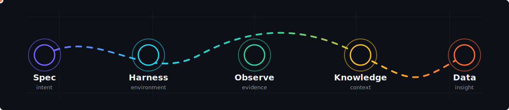

<h1>timezlab</h1>

<strong>Agent-native software labs for specs, operations, knowledge, and data intelligence.</strong>

  <a href="https://timezlab.org">timezlab.org</a>
   / 
  <a href="https://harness.timezlab.org">Harness Kit</a>
   / 
  <a href="https://github.com/timezlab">GitHub</a>

  <code>spec-first</code>
  <code>evidence-driven</code>
  <code>self-hosted</code>
  <code>human-in-the-loop</code>

---

timezlab builds practical systems for the next layer of software work: agents that can plan with explicit specs, act inside owned environments, observe production systems, convert messy context, and explain decisions with evidence.

We like tools that are small enough to understand, serious enough to run, and open enough to adapt. The goal is not to replace judgment, but to move humans to the decisions that matter: scope, review, approval, and trust.

## Lab Themes

| Theme | What we explore | Why it matters |
|-------|-----------------|----------------|
| Agentic engineering | Spec-first task orchestration, isolated worktrees, independent checking, and evidence-based review. | Teams can run more agent work without drowning in diffs. |
| Agent harnesses | Project-owned instructions, skills, memory, and environment scaffolds for coding agents. | Better environments make agents more useful than bigger prompts alone. |
| Self-hosted operations | Observability, RCA, remediation suggestions, and chat-based operations on owned infrastructure. | On-call work needs context, citations, and controlled automation. |
| Knowledge pipelines | Converting messy documents into structured Markdown and agent-ready context. | Better context makes retrieval, reasoning, and review more reliable. |
| Data intelligence | GenBI agents over lakehouse systems with semantic profiles, text-to-SQL, self-correction, governance, and visualization. | Business users should ask data questions naturally without losing control or auditability. |

## Public Work

| Project | Focus | Status |
|---------|-------|--------|
| [SpecDeck](https://github.com/timezlab/specdeck) | A control deck for asynchronous coding agents. Humans review specs, checks, and evidence instead of every line of diff. | Concept and UI scaffold |
| [Harness Kit](https://harness.timezlab.org) | CLI and docs for installing project-owned agent harness artifacts. | Public docs live |
| [Huginn](https://github.com/timezlab/huginn) | Self-hosted observability with an AI agent for RCA, chat, and remediation suggestions. | Design phase |
| [any2md](https://github.com/timezlab/any2md) | Pure-Python document conversion into clean Markdown for knowledge bases and agent workflows. | Active library |

## Operating Principles

1. Specs are contracts. They should be reviewable before code is written and testable after work is done.
2. Evidence beats vibes. A passed check should point to logs, tests, screenshots, traces, or cited data.
3. Self-hosted is a product requirement. Teams should be able to run core systems with their own keys, data, and infrastructure.
4. Agents need boundaries. Narrow tools, explicit permissions, observable traces, and approval gates make automation safer.
5. Context is infrastructure. Docs, telemetry, schemas, and business semantics should be prepared as first-class inputs.

## Useful Links

| Link | Destination |
|------|-------------|
| Website | [timezlab.org](https://timezlab.org) |
| Harness Kit docs | [harness.timezlab.org](https://harness.timezlab.org) |
| GitHub organization | [github.com/timezlab](https://github.com/timezlab) |
