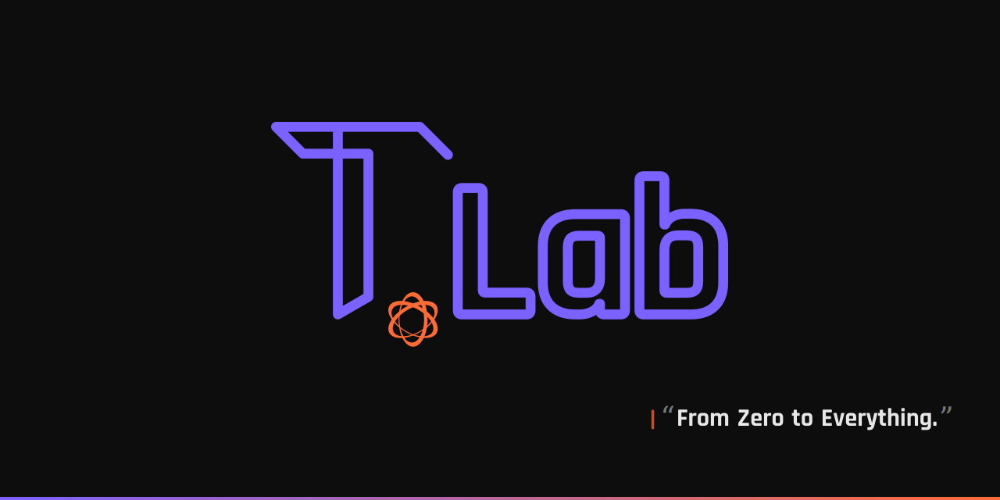

  

  <strong>timezlab</strong> — practical labs for building, testing, and shipping agent-native software.

  <a href="https://timezlab.org">Website</a> ·
  <a href="https://harness.timezlab.org">Harness Kit</a> ·
  <a href="https://github.com/timezlab">GitHub</a>

---

timezlab builds tools and experiments around specifications, automation, developer workflows, and reliable AI-assisted engineering. We keep the lab spirit: small ideas, tight feedback loops, and production-grade craft.

## Projects

| Project | What it is | Link |
|---------|------------|------|
| SpecDeck | Spec-first workspace for orchestrating coding agents on a Kanban board. | [Repository](https://github.com/timezlab/specdeck) |
| Harness Kit | CLI and docs for scaffolding AI agent harness environments. | [Docs](https://harness.timezlab.org) |
| any2md | Convert documents and files to Markdown for agent-ready workflows. | [Repository](https://github.com/timezlab/any2md) |
| Huginn | Self-hosted observability platform with an AI agent. | [Repository](https://github.com/timezlab/huginn) |

## Links

- Website: [timezlab.org](https://timezlab.org)
- Organization: [github.com/timezlab](https://github.com/timezlab)
- Harness Kit docs: [harness.timezlab.org](https://harness.timezlab.org)

## Brand Colors

| Role | Color | Hex |
|------|-------|-----|
| Primary | Vivid Purple | `#7B61FF` |
| Accent | Vibrant Orange | `#FF6B35` |
